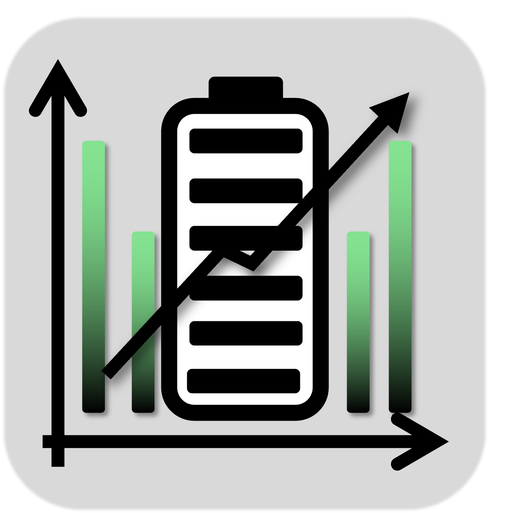
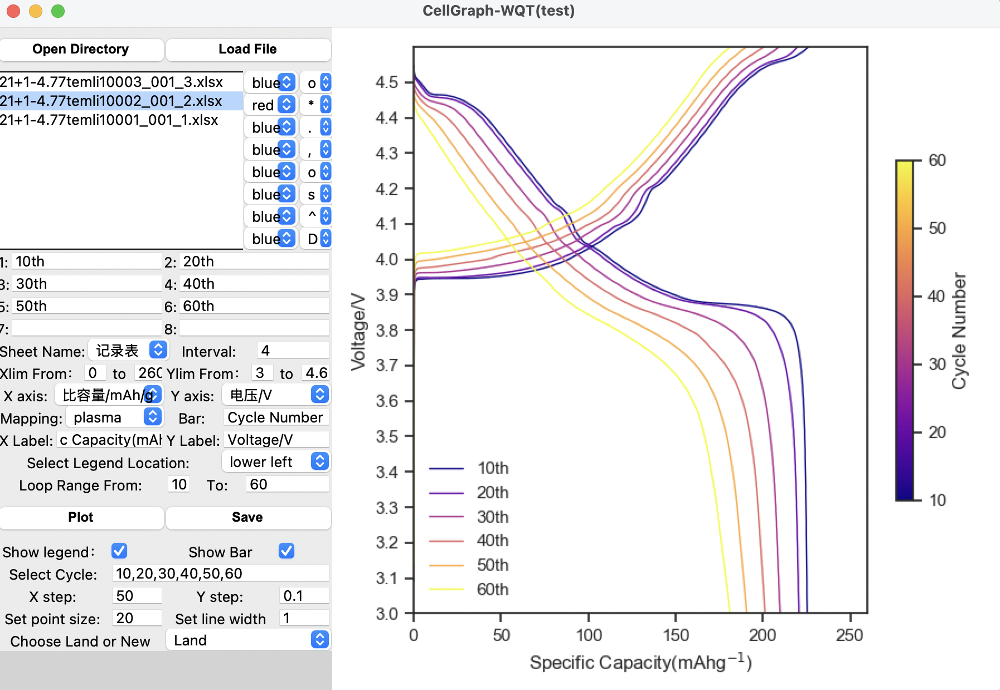
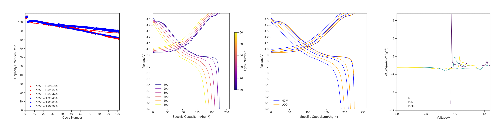

<h1 align="center">
     Cell Graph
</h1>

<h4 align="center">
    Electrochemical Battery Plotting Based on Python
</h4>

    

## Descirption
CellGraph is an electrochemical battery plotting tool inspired by the researchers of Institute of Metal Research,Chinese Academic Sciences(IMR,CAS).It is writen in Python and uses Tkinter for its graphical user interface.The tool supports data formats from **Land** and **Newway**.

## Examples

    

## Features
- [x] Support Charge-Discharge,Capacity Rerention and dQ/dV curve
- [x] Plot curve with customizable color mapping
- [x] Load and visualize multiple files on a single plot
- [x] Customize cycle interval and select specific cycle numbers for precise analysis
- [x] Support custom labels for better visualization

## How to use
### Installation
Currently,only **Windows** systems are supported.Please contact the developer to obtain the application.
### Data Preparation（For LAND）
1. Select the file and open it with `蓝电数据`
2. Click on `工具`,then choose `数据导出`
3. Click `导出设置`，then select `循环范围`,both`方法一`and`方法二`are allowed
4. Set the format to `Excel格式`,choose the option`保存于不同的Excel文件（超行数，自动续表`and check the box`并且不同子表的数据在不同的sheet中`box,set`文件保存类型`as Excel
You can check the final Excel file whether it contains the sheets `记录表` `循环表`.If the file includes these sheets,congratulations!,you have successfully exported the data.

### Load file
Now you have prepared raw data,let's load file with`pandas`.
1. Open `CellGraph`,and click on`Open Directory`,choose the directory that contains the data you need to analyze
2. Select the specific files you want to analyze.You can choose up to 8 files at most
3. Choose  the appropriate  `Sheet Name`and select either Land or NewWay from the `Choose Land or New` dropdown menu
4. Click `Load File`,after a few seconds to a minute (depending on the file size), a message box will appear confirming that the files have been successfully loaded.
### Set Parameters
1. **`Sheet Name`**:The sheet you want to load.For Land you can choose `记录表`or`循环表`,for NewWay you can choose`cycle`or`report`
2. **`Interval`**:For example,if your loop starts at 1 and ends at 100 and `Interval`=10,the selected cycles will be 1,11,21,...
3. `Show legend`&`Show bar`:Whether show the legend/color bar or not
4. `Select Cycle`:Select specific cycle numbers.For example,if you type `1,3,5,10`,the application  will plot curves corresponding to the cycle numbers you entered.(Must be separated by commas in English)
### Attention
If you select multiple files like A.xlsx, B.xlsx, C.xlsx, and want to assign different colors and legends, the order of the legend bars should correspond to the order of the files, similar to how the colors are assigned
